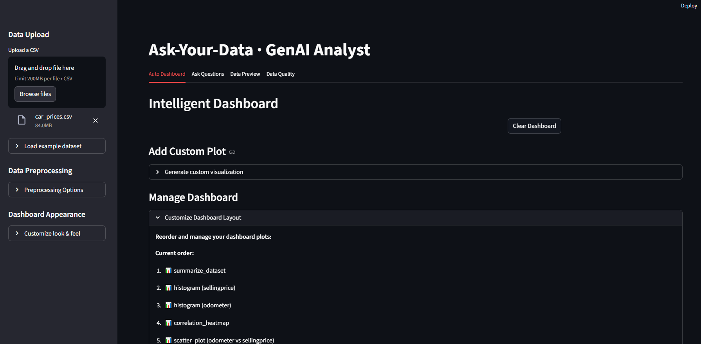

# 🚀 Project Portfolio  

Welcome to my project showcase!  
This portfolio highlights selected academic projects and professional experiences in AI, Data Engineering, Web Development, and IoT.  

---

# 📊 Ask-Your-Data: AI-Powered Data Analysis Platform — *GenAI Analyst*

## Description
Developed a sophisticated **AI-powered data analysis platform** that transforms how users interact with their data through natural language processing and automated visualization generation.  
The system leverages Google's Gemini AI models to interpret user questions, automatically select appropriate analysis methods, and generate publication-ready visualizations, making advanced analytics accessible to non-technical users.

## Key Features
- Natural language data queries with **Gemini 2.5 Pro/Flash** models  
- **15+ automated analysis functions** covering statistics, ML, and visualization  
- Intelligent dashboard generation with **4–8 smart visualizations**  
- Real-time data preprocessing and quality assessment  
- **LangChain integration** for structured tool calling and prompt management  
- Drag-and-drop dashboard customization with interactive plot management  

## Performance Highlights
- **Auto Dashboard Generation:** comprehensive dashboards in **~5–10s**  
- **Query Processing:** natural language → visualization in **~2–4s**  
- **Data Capacity:** handles datasets up to **200MB** (CSV limit)  
- **Tool Selection Accuracy:** **~95%** correct analysis method selection  
- **Visualization Types:** **12+ chart types** with automatic selection  
- **Fallback System:** automatic model switching on rate limits (Pro → Flash)  

## Core Capabilities & Analysis Tools

### 📈 Statistical Analysis
- Comprehensive dataset summaries and statistical overviews  
- Correlation analysis with heatmap generation  
- Group-by aggregations (sum, mean, count, max, min)  
- Distribution analysis via histograms and box plots  

### 🤖 Advanced Analytics
- **Time Series Decomposition** — trend, seasonal, residual  
- **Outlier Detection** — IQR and Z-score based anomalies  
- **Feature Importance** — Random Forest-based modeling  
- **Distribution Comparison** — violin plots across categories  

## Visual Results & Interface Demonstrations

  
*“Intelligent Dashboard” with uploaded `car_prices.csv`; sidebar controls for preprocessing and customization.*

  
*Drag-to-reorder dashboard with 8 active plots (summary, histograms, heatmap, scatter, distribution comparisons).*

  
*6 key visuals: odometer histogram, correlation heatmap, odometer vs. price scatter, top makes bar, body-type distributions, time-series trend.*

  
*Natural language plot requests (e.g., “Show sales trends over time”) with helpful prompt suggestions.*

  
*Query “What are the top 5 categories by revenue?” processed via Gemini 2.5 Pro → interactive bar chart.*

  
*First 10 rows + full schema (types: `object`, `int64`, `float64`).*

  
*Example: 558,837 × 16 dataset; missing data by column (e.g., transmission 11.69%, body 2.36%, …). Types: 11 `object`, 4 `float64`.*

## Implementation Architecture

### 🔧 Technical Stack
- **Frontend:** Streamlit (+ `streamlit-sortables`)  
- **AI Models:** Google Gemini 2.5 Pro/Flash via LangChain  
- **Data Processing:** Pandas, NumPy, SciPy  
- **Visualization:** Plotly  
- **ML Libraries:** scikit-learn  
- **Stats/TS:** statsmodels (time series decomposition)  

---

# 🕵️‍♂️ AI-Based Document Fraud Detection 

**Description:**  
Developed a hybrid AI system for detecting forged regions in digitized documents by combining **Visual Deep Learning (SegFormer)** with **Semantic Analysis (OCR + LLaMA-3)**.  
The system aims to localize tampered areas with high precision and analyze textual inconsistencies, providing a comprehensive fraud detection solution for banking operations.  

**Key Features:**  
- Visual forgery detection using SegFormer-based segmentation model  
- Hierarchical OCR pipeline for structured text extraction from scanned documents  
- Semantic inconsistency analysis powered by LLaMA-3 large language model  
- Microservice-based architecture with Flask (backend) and React (frontend)  
- Explainable AI with visual attention overlays and semantic mismatch reporting  

**Technical Approach:**  
- Custom dataset construction with tampered and original documents  
- Fine-tuned SegFormer model for binary tampering segmentation with hybrid loss (Focal Tversky + Dice)  
- OCR pipeline combining Tesseract and LLMWhisperer  
- LLaMA-3 based semantic detection of anomalies in extracted text  
- REST APIs serving segmentation and semantic analysis results  

**Key Results:**  
- Visual detection recall: **86.5%** on evaluation set  
- Average IoU on segmentation masks: **0.72**  
- System throughput: **< 1.5s per document** on benchmark hardware

**Tech stack:** Python, PyTorch, SegFormer, OCR (LLMWhisperer,Tesseract), LLaMA-3 (Groq API), MongoDB, Flask, React  

**Sample Results:**  

| Ground Truth vs Predicted Masks |  
|---|  
|  |  
*Case 1 — Left: Ground Truth Mask, Right: Model Predicted Mask*  

|  |  
*Case 2 — Left: Ground Truth Mask, Right: Model Predicted Mask*  

|  |  
*Case 3 — Left: Ground Truth Mask, Right: Model Predicted Mask*  

---

**Visual Tampering Detection Interface:**  

  
*Tampering visualization in the deployed system — the model successfully highlighted forged areas directly on the scanned document within the web application interface.*  

---

# 🛂 Automatic License Plate Recognition System  

**Description:**  
Developed a real-time **Automatic License Plate Recognition (ALPR)** system using YOLOv5 for securing vehicle exits at Marsa Maroc.  
The system detects license plates, extracts characters with OCR, and verifies against a database of valid exit permits, aiming to automate and enhance port security.  

**Key Features:**  
- Real-time license plate detection with **YOLOv5** (trained for 30 epochs)  
- OCR character extraction with **YOLOv5-based multi-class detection**  
- Video processing pipeline with detection and database validation  
- Django-based web interface (in progress) for real-time monitoring  
- Integrated MySQL for permit management and system logging  

**Performance Highlights:**  
- License Plate Detection Precision: **97.1%** — Recall: **98.5%**  
- OCR Character Recognition Precision: **88%** — Recall: **91.9%**  
- Video Frame Processing Time: **~614ms – 1292ms per frame**  
- Trained on custom dataset with extended augmentation for robustness

**Visual Results & Sample Predictions:**  

  

  
*Detected license plate cropped from the vehicle image — ready for character recognition.*  

  
*Character detection output on the license plate — bounding boxes with confidence scores for each recognized character.*  

  
*Sorted character predictions with bounding box details and class mapping — automated sorting for correct license plate reconstruction.*  

  
*Sample of class mapping dictionary used to decode YOLOv5 class IDs into readable characters (digits/letters).*  

  
*YOLOv5 running on a live video frame — real-time detection and character recognition results during video processing.*  

**Tech stack:** Python, YOLOv5, OpenCV, MySQL, Django, PhpMyAdmin  

---

# 📊 Inflation Analysis and Interactive Visualization — *Survey-Based Data Analytics Project*  

**Description:**

End-to-end data analytics project analyzing the perceptions and impacts of inflation in Morocco. It combines targeted data collection, EDA, statistical hypothesis testing, and a Flask-based web app with dynamic visualization and prediction features.

**Key Features:**

- Targeted data collection via a custom online form
- Exploratory Data Analysis (distribution plots, correlation matrix, outlier checks)
- Statistical hypothesis testing with real-time result display in the app
- Interactive Flask app: filterable data table, graph gallery, form submission, and user-specific predictions

**Dataset & Collection:**

- **Audience:** students, faculty, professionals (targeted outreach via university emails, LinkedIn, and relevant Facebook groups)
- **Duration:** ~2 weeks of collection
- **Size:** 163 valid responses
- **Privacy-first survey design:** concise form; sensitive questions (e.g., income) handled transparently with confidentiality assurances.

**Methodology:**

**Survey & Cleaning**

- Minimal, focused questionnaire designed for clarity and privacy
- Data cleaning pipeline:
    - Handle missing values & duplicates
    - Detect/treat outliers
    - Normalize/standardize where appropriate
    - Encode categorical variables
    - Custom parser to extract numeric values from income/expense text (e.g., strings with currency hints like “d”, “e”), falling back safely when no number is present.

**Exploratory Data Analysis (EDA)**

- Descriptive stats & distributions (histograms/boxplots)
- Correlation analysis (heatmaps; targeted pairwise checks)
- Guided questions, e.g.:
    - Debt ↔ savings estimation
    - Cost-of-living change ↔ income–expense gap
    - Financial satisfaction ↔ credit presence
    - Household size ↔ estimated expenses
    - Occupation (student/employee) ↔ perception of price change
    - Demographic effects (age/gender) on satisfaction/savings

**Statistical Hypothesis Testing**

- **Means:** savings estimation differences between genders (CI + test)
- **Independence (χ²):** satisfaction vs. age groups
- **Proportions:** perception of change by student vs. employee (CI + test)
- **One-sample mean:** average income vs. minimum wage (CI + test)
- **One-sample proportion:** change in price perception (CI + test)

**Tech stack:** Python, Flask, Pandas, Plotly, Machine Learning  

**Screenshots:**  

  
*Home page of the Inflation Analysis app — entry point to access dataset, forms, and graphs.*  

  
*Inflation Data Collection Form — collecting key socio-economic data from users.*  

  
*Form submission confirmation page with navigation to table, graphs, and prediction features.*  

  
*Prediction interface — provides a summary of personalized insights based on user responses.*  

  
*Interactive dashboard — displaying correlation between financial satisfaction and age group.*  

  
*Hypothesis testing popup with statistical results on perceived price change impact.*  

---

# 📝 AI-Generated Text Detection — *NLP & Machine Learning Project*  

**Description:**  
Developed a robust system for detecting AI-generated text using advanced NLP techniques and Machine Learning models.  
The project pipeline integrates data preprocessing, lexical and syntactic feature engineering, and model evaluation on balanced datasets containing both human-written and AI-generated text samples.  

**Key Features:**  
- Comprehensive text preprocessing (cleaning, lemmatization, stopword removal)  
- Feature engineering including word count, average word length, vocabulary richness, POS tags, sentiment analysis, and readability metrics  
- TF-IDF vectorization for contextual feature extraction  
- Comparative study of ML models: Logistic Regression, Naive Bayes, Random Forest, Neural Networks  
- Achieved **99% accuracy** with the Neural Network model on the validation set  

**Modeling Approach:**  
- Baseline models: Logistic Regression, Naive Bayes, Random Forest  
- Deep Learning model: Neural Network with Dropout & ReLU activations  
- Evaluation using Accuracy, Precision, Recall, F1-Score, and Confusion Matrix  

---

**Results Highlights:**  
- Neural Network Model: **99% Accuracy, 99% F1-Score**  
- Logistic Regression: **97.25% Accuracy**  
- Naive Bayes: **91.8% Accuracy**  
- Random Forest: **91.3% Accuracy**  

**Tech stack:** Python, Scikit-learn, NLTK, Pandas, NumPy, TensorFlow/Keras  

---

# 😊 Facial Emotion Recognition with EfficientNetV2M and Attention Mechanisms — *AffectNet Case Study*  

**Description:**  
Developed a deep learning model for **Facial Emotion Recognition (FER)** based on **EfficientNetV2M** architecture, enhanced with attention mechanisms for improved feature focus and model interpretability.  
The system classifies four primary emotions — **Happiness, Sadness, Fear, and Anger** — using the large-scale AffectNet dataset.  

**Key Features:**  
- Fine-tuned **EfficientNetV2M** on AffectNet with integrated attention modules  
- Applied regularization techniques (dropout, batch normalization) to enhance model stability  
- Designed multi-output architecture with **early exits** for adaptable inference speed  
- Achieved **79.3% validation accuracy** after fine-tuning with attention  
- Addressed interpretability through visual attention maps on facial regions  

**Technical Approach:**  
- Transfer learning using ImageNet-pretrained EfficientNetV2M  
- Attention-based feature refinement  
- Early exits for intermediate classification with dynamic inference  
- Hyperparameter tuning with learning rate scheduling and early stopping  
- Categorical cross-entropy loss with per-output tracking  

**Dataset:**  
- AffectNet (subset of 4 emotions)  
- Training set: 80%, Validation set: 20%, Test set: Hold-out  
- Managed class imbalance through targeted data sampling  

**Evaluation Metrics:**  
- Accuracy, F1-Score, Loss Curves  
- Performance validated on unseen AffectNet samples  

**Results Highlights:**  
- Training Accuracy: **96.1%**  
- Validation Accuracy: **79.3%**  
- Validation Loss: **0.53** at best epoch

**Tech stack:** Python, TensorFlow/Keras, EfficientNetV2M, AffectNet Dataset  

**Sample Prediction Result:**  

  
*Example of a facial emotion recognition prediction on unseen data — the model correctly identified the emotion based on key facial features.*  

---

# 🔤 English ↔ Darija (Moroccan Arabic) Neural Machine Translation 

**Description:** Built a low-resource English–Darija translation pipeline: cleaned a noisy parallel corpus, filled missing English sentences via back-translation, then trained a custom seq2seq LSTM (with a peephole variant) and ran a small hyper-parameter study.

**Problem:** Public Darija–English datasets are small and very incomplete (≈85% of the eng side missing in the sentences split). Dropping those rows would destroy supervision, so we first recover the English side before modeling.

**Data:** Hugging Face imomayiz/darija-english (config: sentences) with darija (Latin), darija_ar (Arabic script), and eng; most eng entries are missing.

**Approach:** EDA + missing-value audit → back-translation of darija_ar using ychafiqui/darija-to-english-2 ( Transformers) with batching & checkpointing; split the missing set into 5 parts for parallel runs, then recombined.

**Preprocessing:** Lowercasing + punctuation strip; word-level tokenization (NLTK); vocab with special tokens (<PAD>, <SOS>, <EOS>, <UNK>); index + pad; build train/val/test loaders (80/10/10).

**Models:** Baseline seq2seq LSTM encoder–decoder (PyTorch) and an advanced variant with a custom LSTM Peephole cell; Seq2Seq forward with teacher forcing; metrics: token-level cross-entropy and validation accuracy.

**Tech stack:** PyTorch, Transformers (HF), datasets (HF), NLTK, pandas, tqdm, matplotlib.

---

# 🔒 Advanced Data Security for Healthcare Systems — *Oracle Database Administration Project*  

**Description:**  
Designed and implemented a secure database architecture for healthcare data management using **Oracle Database**.  
This project integrates advanced security mechanisms such as encryption, masking, role-based access control, and auditing to ensure data confidentiality, integrity, and compliance with healthcare regulations.  

**Key Features:**  
- Role-based access control with user-specific privileges  
- Data encryption for sensitive patient, medical, and financial information  
- Data masking on critical fields (personal details, diagnoses, contact information)  
- Database Vault for enhanced data access control  
- Unified auditing for activity monitoring and anomaly detection  
- Secure data model covering patients, doctors, hospitals, diagnostics, and billing  

**Core Entities & Relationships:**  
- Patient, Doctor, Nurse, Hospital, Bill, Patient_Diagnostic  
- Managed via one-to-many and many-to-one relationships with enforced referential integrity  

**Technical Approach:**  
- Oracle SQL Developer for schema design and user management  
- Implementation of encryption wallets and key management  
- Data masking with Oracle Data Redaction  
- Unified Auditing for centralized security monitoring  

**Tech stack:** Oracle Database, SQL Developer, Oracle Data Vault, Oracle Unified Auditing  

---

# 🌦️ IoT-Based Smart Weather Detection System — *SOLLIS Project*  

**Description:**  
Developed a smart weather detection system leveraging IoT technologies for real-time indoor environment monitoring.  
The system integrates sensors, actuators, and data visualization dashboards, enabling dynamic control and monitoring of temperature, humidity, and light intensity within indoor spaces.  

**Key Features:**  
- Real-time data collection from light and temperature sensors  
- Adaptive LED brightness control based on ambient light levels  
- LCD display showing live temperature and weather status  
- Raspberry Pi-based gateway handling data processing and MQTT communication  
- Node-RED dashboard for real-time visualization and historical trend analysis  
- Continuous data updates and user interaction with the environment  

**System Components:**  
- Arduino + Sensors (Photoresistor, DHT22)  
- Raspberry Pi (data gateway & MQTT broker)  
- Node-RED Dashboard (UI & data visualization)  
- Actuators: LEDs, LCD Screen  

**Example Workflow:**  
- The system detects light intensity and temperature  
- LEDs adjust brightness based on detected light  
- Data sent via MQTT to Node-RED for visualization  
- User views real-time and historical data on the dashboard  

**Tech stack:** Arduino, Raspberry Pi, Node-RED, Python, MQTT  

**Screenshots:**  

  
*Complete system setup integrating Arduino with sensors, actuators, and Raspberry Pi gateway — demonstrating full IoT workflow and communication setup.*  

  
*LCD display showing real-time weather status and temperature readings, providing direct feedback from the sensors.*  

  
*Close-up of the sensor and actuator setup on a breadboard — showcasing LEDs reacting to ambient light and live data being processed by the Arduino.*  

  
*Node-RED flow representing the system’s logic — managing communication between the gateway, sensors, actuators, and the user interface. It handles light threshold checks, command routing, and dashboard interactions.*  

---

# 🎧 Audio Compression System — *IRM Custom Audio Format*  

  
*Interface of the application allowing users to select audio files and apply the IRM compression algorithm.*  

  
*Output showcasing compression results, file size reduction, and comparison with standard formats.*  

**Description:**  
Designed a custom audio compression system named **IRM**, combining **Discrete Wavelet Transform (DWT)** for multi-resolution analysis with the **Lempel-Ziv-Welch (LZW)** algorithm for data reduction.  
The project integrates a user-friendly interface to apply, visualize, and compare compression results with common formats like WAV and OGG.  

**Key Features:**  
- Multi-resolution signal analysis with DWT  
- Entropy-based data compression using LZW  
- Compression/decompression process with quality retention  
- GUI-based interaction for audio processing  

**Tech stack:** Python, NumPy, Tkinter  

---

# 🏥 Healthcare Data Processing Pipeline  
**Description:** Built a real-time Big Data pipeline for healthcare data using Pulsar, Airflow, TensorFlow, and Neo4j.  
**Technologies:** Apache Pulsar, Airflow, Snowflake, Neo4j, TensorFlow  

---

## 📊 Data Analysis and Visualization Projects  

- **Revenue Prediction Model:** Supervised ML model for income prediction. *(Python, Scikit-learn)*  
- **Password Strength Classifier:** ML system for evaluating password robustness. *(Python, XGBoost)*  
- **Fake News Detection:** Machine Learning classifier for fake news detection. *(Python, NLP, Scikit-learn)*  
- **Sales Dashboard in Excel:** Sales data analysis with Excel dashboards.  
- **Web Planner App with Calendar:** Django-based planner with category management and interactive calendar. *(Django, FullCalendar)*  
- **Power BI Dashboard - Blinkit Sales Performance:** Visualized Blinkit app sales with Power BI.  

---

# 🍳 Web Application for Sharing Culinary Recipes — *Spring Boot MVC Project*  

**Description:**  
Designed and developed a full-stack web application for culinary recipe sharing.  
The system allows users to explore, publish, edit, and interact with recipes through comments and favorites. The project emphasizes modular design using **Spring Boot (MVC Architecture)**, ensuring scalability, maintainability, and a smooth user experience.  

**Key Features:**  
- User authentication, registration, and profile management  
- Personal dashboard displaying user's recipes and comments  
- CRUD operations for recipe management with image upload support  
- Community interaction through comments and recipe favoriting  
- Categorization of recipes for easy browsing  
- MVC architecture with Thymeleaf front-end  

**Core System Components:**  
- **Entities:** User, Recipe, Comment, Category  
- **Relationships:**  
  - One-to-Many (User–Recipe, User–Comment)  
  - Many-to-Many (User–Favorite Recipes)  
  - One-to-Many (Category–Recipe)  

**Tech stack:** Java, Spring Boot, Thymeleaf, MySQL, Spring Security, JPA/Hibernate  

---

# 🛒 E-Commerce Platform Development   
**Description:** Developed a full-featured e-commerce platform using PHP and MySQL following MVC architecture.  
**Key Deliverables:**

- **Role-based auth & access control:** Visitors, customers, and admins, each with a dedicated dashboard.
- **Catalog & inventory:** Complete product catalog with category management and CRUD for products/stock via the admin interface.
- **Secure order/payment flow:** Password hashing, robust ID management, and step-by-step order handling.
- **Admin–seller operations dashboard:** Real-time tracking of client info, items, order status, and direct contact actions.
- **Responsive dashboards:** Data-driven views for sales, inventory status, and activity monitoring.

**Impact:** Digitized the sales cycle and strengthened the client’s online presence, opening a new revenue channel.

**Tech stack:** PHP, MySQL, HTML, CSS, Bootstrap  

