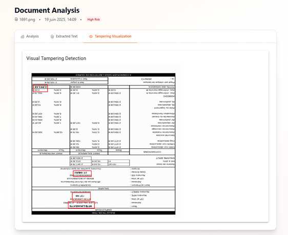

# 🚀 Aya Karbich | Project Portfolio  

Welcome to my project showcase!  
This portfolio highlights selected academic projects and professional experiences in AI, Data Engineering, Web Development, and IoT.  

---

## 🎓 Academic Projects  

### 🎧 Audio Compression System — *IRM Custom Audio Format*  

  
*Interface of the application allowing users to select audio files and apply the IRM compression algorithm.*  

  
*Output showcasing compression results, file size reduction, and comparison with standard formats.*  

**Description:**  
Designed a custom audio compression system named **IRM**, combining **Discrete Wavelet Transform (DWT)** for multi-resolution analysis with the **Lempel-Ziv-Welch (LZW)** algorithm for data reduction.  
The project integrates a user-friendly interface to apply, visualize, and compare compression results with common formats like WAV and OGG.  

**Key Features:**  
- Multi-resolution signal analysis with DWT  
- Entropy-based data compression using LZW  
- Compression/decompression process with quality retention  
- GUI-based interaction for audio processing  

**Technologies:** Python, NumPy, Tkinter  
 

---

### 📊 Inflation Analysis and Interactive Visualization — *Survey-Based Data Analytics Project*  

**Description:**  
End-to-end data analytics project analyzing the perceptions and impacts of inflation in Morocco.  
It combines targeted data collection, EDA, statistical hypothesis testing, and a Flask-based web app with dynamic visualization and prediction features.

**Key Features:**  
- Data collection via custom-designed form  
- Exploratory Data Analysis and correlation studies  
- Hypothesis testing with real-time statistical result display  
- Interactive web app with filters and user-specific predictions  

**Screenshots:**  

  
*Home page of the Inflation Analysis app — entry point to access dataset, forms, and graphs.*  

  
*Inflation Data Collection Form — collecting key socio-economic data from users.*  

  
*Form submission confirmation page with navigation to table, graphs, and prediction features.*  

  
*Prediction interface — provides a summary of personalized insights based on user responses.*  

  
*Interactive dashboard — displaying correlation between financial satisfaction and age group.*  

  
*Hypothesis testing popup with statistical results on perceived price change impact.*  

**Technologies:** Python, Flask, Pandas, Plotly, Machine Learning  

---

### 📝 AI-Generated Text Detection — *NLP & Machine Learning Project*  

**Description:**  
Developed a robust system for detecting AI-generated text using advanced NLP techniques and Machine Learning models.  
The project pipeline integrates data preprocessing, lexical and syntactic feature engineering, and model evaluation on balanced datasets containing both human-written and AI-generated text samples.  

**Key Features:**  
- 🧹 Comprehensive text preprocessing (cleaning, lemmatization, stopword removal)  
- 🗃️ Feature engineering including word count, average word length, vocabulary richness, POS tags, sentiment analysis, and readability metrics  
- 📊 TF-IDF vectorization for contextual feature extraction  
- 🤖 Comparative study of ML models: Logistic Regression, Naive Bayes, Random Forest, Neural Networks  
- 📝 Achieved **99% accuracy** with the Neural Network model on the validation set  

**Modeling Approach:**  
- Baseline models: Logistic Regression, Naive Bayes, Random Forest  
- Deep Learning model: Neural Network with Dropout & ReLU activations  
- Evaluation using Accuracy, Precision, Recall, F1-Score, and Confusion Matrix  

**Technologies:** Python, Scikit-learn, NLTK, Pandas, NumPy, TensorFlow/Keras  

---

**Results Highlights:**  
- 🏆 Neural Network Model: **99% Accuracy, 99% F1-Score**  
- Logistic Regression: **97.25% Accuracy**  
- Naive Bayes: **91.8% Accuracy**  
- Random Forest: **91.3% Accuracy**  

---

### 🔒 Advanced Data Security for Healthcare Systems — *Oracle Database Administration Project*  

**Description:**  
Designed and implemented a secure database architecture for healthcare data management using **Oracle Database**.  
This project integrates advanced security mechanisms such as encryption, masking, role-based access control, and auditing to ensure data confidentiality, integrity, and compliance with healthcare regulations.  

**Key Features:**  
- 🔐 Role-based access control with user-specific privileges  
- 🗝️ Data encryption for sensitive patient, medical, and financial information  
- 🕵️ Data masking on critical fields (personal details, diagnoses, contact information)  
- 🔒 Database Vault for enhanced data access control  
- 📜 Unified auditing for activity monitoring and anomaly detection  
- 🗄️ Secure data model covering patients, doctors, hospitals, diagnostics, and billing  

**Core Entities & Relationships:**  
- Patient, Doctor, Nurse, Hospital, Bill, Patient_Diagnostic  
- Managed via one-to-many and many-to-one relationships with enforced referential integrity  

**Technical Approach:**  
- Oracle SQL Developer for schema design and user management  
- Implementation of encryption wallets and key management  
- Data masking with Oracle Data Redaction  
- Unified Auditing for centralized security monitoring  

**Technologies:** Oracle Database, SQL Developer, Oracle Data Vault, Oracle Unified Auditing  

---

### 📈 Sales Datamart with ETL  
**Description:** Designed a sales datamart with star schema and implemented ETL pipelines with Talend.  
**Technologies:** Talend, MySQL  

---

### 💪 Fitness Application with Azure Integration  
**Description:** Built a fitness app with secure authentication via Azure AD and automated notifications using Azure Logic Apps.  
**Technologies:** Java, Hibernate, Azure AD, SQL Server  

---

### 🌦️ IoT-Based Smart Weather Detection System — *SOLLIS Project*  

**Description:**  
Developed a smart weather detection system leveraging IoT technologies for real-time indoor environment monitoring.  
The system integrates sensors, actuators, and data visualization dashboards, enabling dynamic control and monitoring of temperature, humidity, and light intensity within indoor spaces.  

**Key Features:**  
- 📡 Real-time data collection from light and temperature sensors  
- 💡 Adaptive LED brightness control based on ambient light levels  
- 🖥️ LCD display showing live temperature and weather status  
- 🗄️ Raspberry Pi-based gateway handling data processing and MQTT communication  
- 📊 Node-RED dashboard for real-time visualization and historical trend analysis  
- 🔁 Continuous data updates and user interaction with the environment  

**System Components:**  
- Arduino + Sensors (Photoresistor, DHT22)  
- Raspberry Pi (data gateway & MQTT broker)  
- Node-RED Dashboard (UI & data visualization)  
- Actuators: LEDs, LCD Screen  

**Example Workflow:**  
- The system detects light intensity and temperature  
- LEDs adjust brightness based on detected light  
- Data sent via MQTT to Node-RED for visualization  
- User views real-time and historical data on the dashboard  

**Technologies:** Arduino, Raspberry Pi, Node-RED, Python, MQTT  

**Screenshots:**  

  
*Complete system setup integrating Arduino with sensors, actuators, and Raspberry Pi gateway — demonstrating full IoT workflow and communication setup.*  

  
*LCD display showing real-time weather status and temperature readings, providing direct feedback from the sensors.*  

  
*Close-up of the sensor and actuator setup on a breadboard — showcasing LEDs reacting to ambient light and live data being processed by the Arduino.*  

  
*Node-RED flow representing the system’s logic — managing communication between the gateway, sensors, actuators, and the user interface. It handles light threshold checks, command routing, and dashboard interactions.*  

---

### 😊 Facial Emotion Recognition with EfficientNetV2M and Attention Mechanisms — *AffectNet Case Study*  

**Description:**  
Developed a deep learning model for **Facial Emotion Recognition (FER)** based on **EfficientNetV2M** architecture, enhanced with attention mechanisms for improved feature focus and model interpretability.  
The system classifies four primary emotions — **Happiness, Sadness, Fear, and Anger** — using the large-scale AffectNet dataset.  

**Key Features:**  
- Fine-tuned **EfficientNetV2M** on AffectNet with integrated attention modules  
- Applied regularization techniques (dropout, batch normalization) to enhance model stability  
- Designed multi-output architecture with **early exits** for adaptable inference speed  
- Achieved **79.3% validation accuracy** after fine-tuning with attention  
- Addressed interpretability through visual attention maps on facial regions  

**Technical Approach:**  
- Transfer learning using ImageNet-pretrained EfficientNetV2M  
- Attention-based feature refinement  
- Early exits for intermediate classification with dynamic inference  
- Hyperparameter tuning with learning rate scheduling and early stopping  
- Categorical cross-entropy loss with per-output tracking  

**Dataset:**  
- AffectNet (subset of 4 emotions)  
- Training set: 80%, Validation set: 20%, Test set: Hold-out  
- Managed class imbalance through targeted data sampling  

**Evaluation Metrics:**  
- Accuracy, F1-Score, Loss Curves  
- Performance validated on unseen AffectNet samples  

**Results Highlights:**  
- 🟢 Training Accuracy: **96.1%**  
- 🟡 Validation Accuracy: **79.3%**  
- 📉 Validation Loss: **0.53** at best epoch

**Sample Prediction Result:**  

  
*Example of a facial emotion recognition prediction on unseen data — the model correctly identified the emotion based on key facial features.*  

**Technologies:** Python, TensorFlow/Keras, EfficientNetV2M, AffectNet Dataset  

---

### 🔤 English-Darija Translation with RNNs  
**Description:** Trained translation models with Vanilla LSTM and LSTM with Peephole connections on a custom dataset.  
**Technologies:** Python, PyTorch, Hugging Face Datasets  

---

### 🏥 Healthcare Data Processing Pipeline  
**Description:** Built a real-time Big Data pipeline for healthcare data using Pulsar, Airflow, TensorFlow, and Neo4j.  
**Technologies:** Apache Pulsar, Airflow, Snowflake, Neo4j, TensorFlow  

---

## 📊 Data Analysis and Visualization Projects  

- **Revenue Prediction Model:** Supervised ML model for income prediction. *(Python, Scikit-learn)*  
- **Password Strength Classifier:** ML system for evaluating password robustness. *(Python, XGBoost)*  
- **Fake News Detection:** Machine Learning classifier for fake news detection. *(Python, NLP, Scikit-learn)*  
- **Sales Dashboard in Excel:** Sales data analysis with Excel dashboards.  
- **Web Planner App with Calendar:** Django-based planner with category management and interactive calendar. *(Django, FullCalendar)*  
- **Power BI Dashboard - Blinkit Sales Performance:** Visualized Blinkit app sales with Power BI.  

---

### 🍳 Web Application for Sharing Culinary Recipes — *Spring Boot MVC Project*  

**Description:**  
Designed and developed a full-stack web application for culinary recipe sharing.  
The system allows users to explore, publish, edit, and interact with recipes through comments and favorites. The project emphasizes modular design using **Spring Boot (MVC Architecture)**, ensuring scalability, maintainability, and a smooth user experience.  

**Key Features:**  
- 🧑‍🍳 User authentication, registration, and profile management  
- 📑 Personal dashboard displaying user's recipes and comments  
- 📝 CRUD operations for recipe management with image upload support  
- ⭐ Community interaction through comments and recipe favoriting  
- 📂 Categorization of recipes for easy browsing  
- 🖥️ MVC architecture with Thymeleaf front-end  

**Core System Components:**  
- **Entities:** User, Recipe, Comment, Category  
- **Relationships:**  
  - One-to-Many (User–Recipe, User–Comment)  
  - Many-to-Many (User–Favorite Recipes)  
  - One-to-Many (Category–Recipe)  

**Technologies:** Java, Spring Boot, Thymeleaf, MySQL, Spring Security, JPA/Hibernate  

---

## 💼 Professional Experience  

### 🕵️‍♂️ AI-Based Document Forgery Detection — *Attijariwafa Bank Industrial Project*  

**Description:**  
Developed a hybrid AI system for detecting forged regions in digitized documents by combining **Visual Deep Learning (SegFormer)** with **Semantic Analysis (OCR + LLaMA-3)**.  
The system aims to localize tampered areas with high precision and analyze textual inconsistencies, providing a comprehensive fraud detection solution for banking operations.  

**Key Features:**  
- 🖼️ Visual forgery detection using SegFormer-based segmentation model  
- 📄 Hierarchical OCR pipeline for structured text extraction from scanned documents  
- 🤖 Semantic inconsistency analysis powered by LLaMA-3 large language model  
- 🏭 Microservice-based architecture with Flask (backend) and React (frontend)  
- 💬 Explainable AI with visual attention overlays and semantic mismatch reporting  

**Technical Approach:**  
- Custom dataset construction with tampered and original documents  
- Fine-tuned SegFormer model for binary tampering segmentation with hybrid loss (Focal Tversky + Dice)  
- OCR pipeline combining Tesseract and LLMWhisperer  
- LLaMA-3 based semantic detection of anomalies in extracted text  
- REST APIs serving segmentation and semantic analysis results  

**Key Results:**  
- Visual detection recall: **86.5%** on evaluation set  
- Average IoU on segmentation masks: **0.72**  
- System throughput: **< 1.5s per document** on benchmark hardware

**Sample Results:**  

| Ground Truth vs Predicted Masks |  
|---|  
|  |  
*Case 1 — Left: Ground Truth Mask, Right: Model Predicted Mask*  

|  |  
*Case 2 — Left: Ground Truth Mask, Right: Model Predicted Mask*  

|  |  
*Case 3 — Left: Ground Truth Mask, Right: Model Predicted Mask*  

---

**Visual Tampering Detection Interface:**  

  
*Tampering visualization in the deployed system — the model successfully highlighted forged areas directly on the scanned document within the web application interface.*  

**Technologies:** Python, PyTorch, SegFormer, OCR (LLMWhisperer,Tesseract), LLaMA-3 (Groq API), MongoDB, Flask, React  

---

### 🛂 Automatic License Plate Recognition System — *Marsa Maroc Security Project*  

**Description:**  
Developed a real-time **Automatic License Plate Recognition (ALPR)** system using YOLOv5 for securing vehicle exits at Marsa Maroc.  
The system detects license plates, extracts characters with OCR, and verifies against a database of valid exit permits, aiming to automate and enhance port security.  

**Key Features:**  
- Real-time license plate detection with **YOLOv5** (trained for 30 epochs)  
- OCR character extraction with **YOLOv5-based multi-class detection**  
- Video processing pipeline with detection and database validation  
- Django-based web interface (in progress) for real-time monitoring  
- Integrated MySQL for permit management and system logging  

**Performance Highlights:**  
- ✅ License Plate Detection Precision: **97.1%** — Recall: **98.5%**  
- ✅ OCR Character Recognition Precision: **88%** — Recall: **91.9%**  
- 🕒 Video Frame Processing Time: **~614ms – 1292ms per frame**  
- ⚡ Trained on custom dataset with extended augmentation for robustness

**Visual Results & Sample Predictions:**  

  

  
*Detected license plate cropped from the vehicle image — ready for character recognition.*  

  
*Character detection output on the license plate — bounding boxes with confidence scores for each recognized character.*  

  
*Sorted character predictions with bounding box details and class mapping — automated sorting for correct license plate reconstruction.*  

  
*Sample of class mapping dictionary used to decode YOLOv5 class IDs into readable characters (digits/letters).*  

  
*YOLOv5 running on a live video frame — real-time detection and character recognition results during video processing.*  

**Technologies:** Python, YOLOv5, OpenCV, MySQL, Django, PhpMyAdmin  

---

### 🛒 E-Commerce Platform Development — *Palfarism*  
**Description:** Developed a full-featured e-commerce platform using PHP and MySQL following MVC architecture.  
**Technologies:** PHP, MySQL, HTML, CSS, Bootstrap  

---

## 📝 Contact  
Feel free to reach out for collaboration or inquiries!  

---

